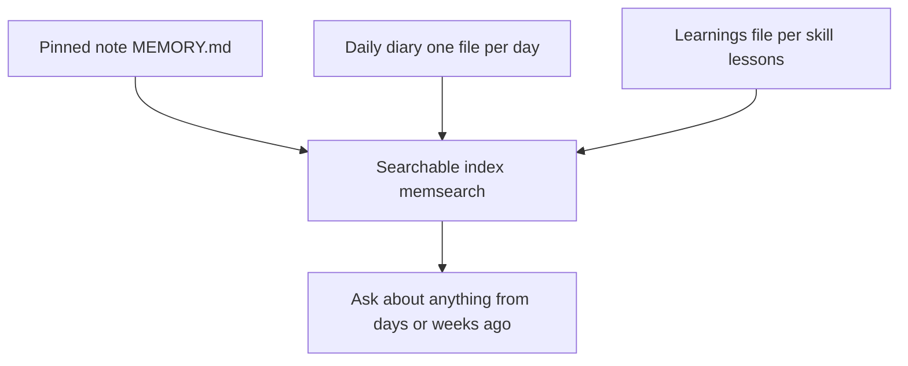

# How AI-OS memory and cron jobs work (plain words)

*Updated 2026-06-22. A non-technical explainer so you know what is actually happening under the hood.*

> Same system, two docs: this file explains the memory stack and how to make cron durable in plain words. For the command reference (start, stop, status, logs, schedule options, and the Command Centre host), see the README "Scheduled Jobs (Cron)" section. The daemon described here is the same managed runtime the README documents.

## The memory stack, top to bottom

AI-OS keeps memory in four layers. Each layer has a different job, and they work together.



1. **The pinned note** (`context/MEMORY.md`). One small file capped at 2,500 characters. Holds your current working threads, environment facts, and decisions waiting on you. Loaded silently at the start of every session, so the assistant always knows the lay of the land.

2. **The daily diary** (`context/memory/{YYYY-MM-DD}.md`). One file per day. The assistant writes a session block each time it works with you. Has the goal, the deliverables, the decisions, and any loose ends. Today's file is loaded silently at session start.

3. **The learnings file** (`context/learnings.md`). Per-skill lessons accumulated over time. Loaded only when a skill runs, not at startup.

4. **The full searchable index** (memsearch). The other three layers plus your operator profile, brand context, Notion sync, and chat transcripts get turned into a search index. When you ask about something from days or weeks ago, the assistant searches this and pulls back the matching notes.

## Memsearch and Milvus, in plain words

**Memsearch** is the search tool. You type a question in normal English, it finds matching notes.

**Milvus** is the engine that does the matching. It stores "embeddings" of every note (a list of numbers that represents the meaning of the text). When you search, it turns your query into the same kind of number list and finds the closest matches by distance. Think of it like a library where every book sits on a shelf based on what it is about, not alphabetically. Two books about the same thing end up next to each other.

AI-OS uses **Milvus Lite**, the version that runs inside the memsearch process. There is no separate server to start. The data lives in one file: `~/.memsearch/milvus.db`. The harmless `too_many_pings` warning you may see in logs is just gRPC keepalive noise. It is silenced by setting `GLOG_minloglevel=3` and `GRPC_VERBOSITY=NONE` in any environment that runs memsearch.

The embedding model is **ONNX**, running locally on your CPU. No external API call, no cost per query. The tradeoff is speed: about half a second to embed one chunk. That is fast enough for live search, but slow for a full reindex. The nightly job lists the complete source set without `--force`, so unchanged files are skipped; the weekly job uses `--force` when a full rebuild is needed.

## Cron jobs, in plain words

A cron job is a task that runs on a schedule. AI-OS has 5 active memory jobs that maintain the memory system without you having to think about it.

Each job is a markdown file in `cron/jobs/` with two parts:
- A YAML header (name, time, schedule, model, timeout). Example: `time: '23:30', days: daily, active: 'true', timeout: 20m`.
- A prompt body. When the schedule fires, the cron daemon spawns a one-shot `claude` session, feeds it the prompt body, and waits for it to finish.

The cron daemon is a node process that watches the schedule and does the spawning. Run it manually with `bash scripts/start-crons.sh`. Make it run on its own forever via launchd (see `~/Library/LaunchAgents/com.aios.cron-daemon.plist`).

### What each active memory job does

| Job | Schedule (exact) | On or Off | What it does |
|-----|------------------|-----------|--------------|
| `daily-memory-distill` | 23:00 daily | On | Reads today's session blocks and updates MEMORY.md (promotes warm threads, retires resolved ones). |
| `nightly-memsearch-index` | 23:30 daily | On | Re-indexes the complete AI-OS source set without `--force`, so unchanged files are skipped but destructive-sync never drops sources. |
| `weekly-memory-gaps` | Sun 23:31 | On | Notices days that should have a diary entry but do not, and flags them before the curator runs. |
| `weekly-memory-curator` | Sun 23:32 | On | Tidies the pinned note: drops stale entries, merges duplicates, keeps it under 2,500 characters. |
| `weekly-memsearch-rebuild` | Sun 23:33 | On | Runs the same complete source set with `--force` to rebuild every embedding. |

Off by default: `weekly-activity-digest` (Fri 17:00), plus `monthly-learnings-health`, `skill-update-check`, `skills-library-digest`, `skills-library-review-watcher`, and `youtube-newsletter`. Turn one on by setting `active: 'true'` in its YAML header.

### Why a cron job needs auth (and the 401 wall)

The cron daemon spawns the bare `claude` binary, not your interactive shell. Your shell may wrap `claude` so a secret manager injects your key, but the daemon does not use those shell wrappers. If the bare binary has no stored credential, **every scheduled job fails with HTTP 401 "Invalid authentication credentials."** This is the single most common reason nightly jobs do nothing.

The fix is a long-lived Claude token, set once. Two steps:

1. Get the token (interactive, needs your Claude subscription):

   ```
   claude setup-token
   ```

   Copy the token it prints.

2. Hand it to the one-step enabler:

   ```
   bash scripts/enable-cron.sh <token>
   ```

That script stores the token at `~/.config/claude-code-oauth-token` (chmod 600), loads the durable launchd cron daemon, and runs one test job so you can see `result: success` before you trust it. Everything after `claude setup-token` is automated. If you ever re-run `enable-cron.sh` with no token and one is already stored, it reuses the stored token.

If you prefer to keep all secrets in a password manager instead, a service-account token path also works through `scripts/claude-cron-wrapper.sh`, but the token above is the simpler default.

## The daemon is durable now

The launchd plist at `~/Library/LaunchAgents/com.aios.cron-daemon.plist` starts the daemon on every login (running `cron-daemon.cjs serve`), restarts it if it dies, and routes claude through the auth wrapper. Once you set the credential, load it with one command (see the runbook in `projects/meta-audit/2026-06-21_cron-and-search-fixes.md`).

## But the Mac has to be awake (the nightly wake)

The daemon can only run a job while the Mac is awake. A laptop asleep at 23:00 runs nothing at 23:00. So on a laptop, two things make it reliable without keeping the Mac awake all night:

- **One nightly wake.** macOS wakes the Mac once a night while it is plugged in: `sudo pmset repeat wakeorpoweron MTWRFSU 23:35:00`. Every job is scheduled just before that wake, so they run as one batch in scheduled-time order, then the Mac sleeps again.
- **Failsafes.** If the Mac is closed or unplugged at the wake, the batch runs the moment you next open it. It also survives a reboot: the daemon remembers the last run in `.command-centre/cron-last-sweep.json`.

This is why all the active jobs sit between 23:00 and 23:33, so they land in the one nightly wake window. Full setup is in `turn-on-nightly-jobs.md`.

---
Part of the AI-OS docs (see README.md for the map). Read next: Turn on the nightly jobs (turn-on-nightly-jobs.md).
