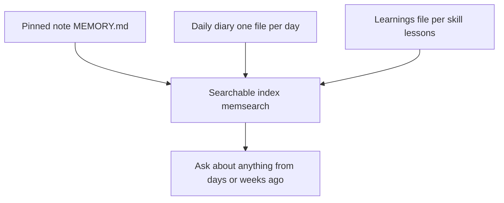

# How AI-OS memory and cron jobs work (plain words)

*Updated 2026-06-22. A non-technical explainer so you know what is actually happening under the hood.*

> Same system, two docs: this file explains the memory stack and how to make cron durable in plain words. For the command reference (start, stop, status, logs, schedule options, and the Command Centre host), see the README "Scheduled Jobs (Cron)" section. The daemon described here is the same managed runtime the README documents.

## The memory stack, top to bottom

AI-OS keeps memory in four layers. Each layer has a different job, and they work together.

1. **The pinned note** (`context/MEMORY.md`). One small file capped at 2,500 characters. Holds your current working threads, environment facts, and decisions waiting on you. Loaded silently at the start of every session, so the assistant always knows the lay of the land.

2. **The daily diary** (`context/memory/{YYYY-MM-DD}.md`). One file per day. The first real prompt creates a session block, and wrap-up finalises it with the goal, deliverables, decisions, and loose ends. Today's file is loaded silently at session start.

3. **The learnings file** (`context/learnings.md`). Per-skill lessons accumulated over time. Loaded only when a skill runs, not at startup.

4. **The searchable memory index** (memsearch). The durable memory layers get turned into a bounded semantic search index. Client brand context can be searched when recall is scoped to clients; broader reference surfaces such as root brand context, Notion sync, and chat transcripts are explicit deep-search/reference material, not routine memory recall.

## Memsearch and Milvus, in plain words

**Memsearch** is the search tool. You type a question in normal English, it finds matching notes.

**Milvus** is the engine that does the matching. It stores "embeddings" of every note (a list of numbers that represents the meaning of the text). When you search, it turns your query into the same kind of number list and finds the closest matches by distance. Think of it like a library where every book sits on a shelf based on what it is about, not alphabetically. Two books about the same thing end up next to each other.

AI-OS uses **Milvus Lite**, the version that runs inside the memsearch process. There is no separate server to start. The data lives in one file: `~/.memsearch/milvus.db`. The harmless `too_many_pings` warning you may see in logs is just gRPC keepalive noise. It is silenced by setting `GLOG_minloglevel=3` and `GRPC_VERBOSITY=NONE` in any environment that runs memsearch.

Milvus Lite is single-process. While an index job is writing to it, live semantic search may return a lock error. That is temporary unavailability, not missing memory. Agents should fall back to the markdown search layer and retry semantic search after the job finishes if semantic matching is still needed.

Manual recall should use `bash scripts/memsearch-search.sh "your query" 10`, which resolves the canonical AI-OS collection, runs semantic search, runs deterministic markdown recall, and fuses both result sets. This matters because semantic search can return broad nearby context while exact markdown hits catch specific terms like attachment fields, duplicate handling, or workflow names. From the root workspace, the wrapper defaults to root AI-OS memory only. From inside a client folder, it scopes recall to that client. Force a boundary with `--scope root|client|clients|all` and `--client slug` when needed. If Milvus cannot start, the wrapper returns markdown results only. The markdown layer reads root/client `context/MEMORY.md`, `context/memory/`, `context/learnings.md`, and client `brand_context/` only when client scope is included, so it needs no lock file, local port, external service, or Codex escalation. Root transcripts and broad reference archives require explicit deep search. The plugin's `.memsearch/memory/` shadow captures are diagnostic material only; they are not authoritative AI-OS recall sources.

In Codex, semantic MemSearch commands need escalated permissions because the local database lives under `~/.memsearch` and Milvus Lite binds a local loopback port even for read-only search. The markdown fallback does not need escalation.

Codex also blocks raw `memsearch search`, `memsearch expand`, `memsearch index`, and `memsearch stats` commands through the AI-OS authority guard. That block is intentional: direct MemSearch calls can bypass the canonical collection and fallback layer. Use `scripts/memsearch-search.sh` for recall and `scripts/memsearch-reindex.sh` for indexing.

The embedding model is **ONNX**, running locally on your CPU. No external API call, no cost per query. The tradeoff is speed: about half a second to embed one chunk. That is fast enough for live search, but slow for a full reindex. The nightly and weekly jobs list the complete semantic source set - root memory plus every discovered `clients/*` memory workspace - without `--force`, so unchanged files are skipped and destructive-sync never drops sources. Client brand context stays in scoped markdown recall, and transcripts stay behind explicit deep search because transcript archives can be too large and often contain client-specific material that should not appear in root recall. Manual force rebuilds are still possible with `bash scripts/memsearch-reindex.sh --force`, but they are intentionally not scheduled.

## Cron jobs, in plain words

A cron job is a task that runs on a schedule. AI-OS has active root and client memory jobs that maintain the memory system without you having to think about it.

Each job is a markdown file in `cron/jobs/` with two parts:
- A YAML header (name, time, schedule, model, timeout). Example: `time: '23:30', days: daily, active: 'true', timeout: 2h`.
- A prompt body. When the schedule fires, the cron daemon spawns a one-shot `claude` session, feeds it the prompt body, and waits for it to finish.

The cron daemon is a node process that watches the schedule and does the spawning. Run it manually with `bash scripts/start-crons.sh`. Make it run on its own forever via launchd (see `~/Library/LaunchAgents/com.aios.cron-daemon.plist`).

### What each active memory job does

| Job | Schedule (exact) | On or Off | What it does |
|-----|------------------|-----------|--------------|
| `daily-memory-distill` | 23:00 daily | On | Reads today's session blocks and updates MEMORY.md (promotes warm threads, retires resolved ones). |
| `client-memory-distill` | 23:05 daily | On | Reads today's client session blocks and updates each client `context/MEMORY.md` without writing root memory. |
| `client-memory-gaps` | Sun 23:26 | On | Writes per-client memory gap reports under each client's `context/memory/`. |
| `client-memory-curator` | Sun 23:27 | On | Removes clearly resolved lines from each client `context/MEMORY.md` before indexing. |
| `nightly-memsearch-index` | 23:30 daily | On | Re-indexes the complete AI-OS source set without `--force`, so unchanged files are skipped but destructive-sync never drops sources. |
| `weekly-memory-gaps` | Sun 23:31 | On | Notices days that should have a diary entry but do not, and flags them before the curator runs. |
| `weekly-memory-curator` | Sun 23:32 | On | Tidies the pinned note: drops stale entries, merges duplicates, keeps it under 2,500 characters. |
| `weekly-memsearch-rebuild` | Sun 23:33 | On | Runs the same complete source set as a second maintenance sync, without forced re-embedding. |

The shared reindex script uses `scripts/memsearch-fast-index.py` when available. That keeps raw source paths for the memory files while loading existing chunk hashes once for the whole collection instead of once per file. Larger reference surfaces such as root `context/notion/` and transcripts stay available only through explicit deep search instead of routine semantic indexing.

Off by default: `weekly-activity-digest` (Fri 17:00), plus `monthly-learnings-health`, `skill-update-check`, `skills-library-digest`, `skills-library-review-watcher`, and `youtube-newsletter`. Turn one on by setting `active: 'true'` in its YAML header.

### Why a cron job needs auth (and the auth wall you just hit)

The cron daemon spawns the `claude` binary. Your interactive shell aliases `claude` to `op run --env-file=~/.config/ai-keys.env -- claude` so 1Password injects your API key. The daemon does NOT use your shell aliases; it runs the bare binary. If the bare binary has no credential, every job fails with HTTP 401 "Invalid authentication credentials."

There are two valid headless auth paths (see `scripts/claude-cron-wrapper.sh` for the wrapper that uses them):
1. **OAuth via `claude /login`.** Creates `~/.claude/.credentials.json`, which the bare binary reads. Lasts months. One step, no 1Password needed for cron.
2. **A 1Password Service Account token** in `~/.config/op-cron-token`. Lets `op run` work unattended. Better if you want all secrets to keep coming from 1Password.

Option 1 is simpler. Use it unless you have a reason to keep secrets only in 1Password.

## The daemon is durable now

The launchd plist at `~/Library/LaunchAgents/com.aios.cron-daemon.plist` starts the daemon on every login (running `cron-daemon.cjs serve`), restarts it if it dies, and routes claude through the auth wrapper. Once you set the credential, load it with one command (see the runbook in `projects/meta-audit/2026-06-21_cron-and-search-fixes.md`).

## But the Mac has to be awake (the nightly wake)

The daemon can only run a job while the Mac is awake. A laptop asleep at 23:00 runs nothing at 23:00. So on a laptop, two things make it reliable without keeping the Mac awake all night:

- **One nightly wake.** macOS wakes the Mac once a night while it is plugged in: `sudo pmset repeat wakeorpoweron MTWRFSU 23:35:00`. Every job is scheduled just before that wake, so they run as one batch in scheduled-time order, then the Mac sleeps again.
- **Failsafes.** If the Mac is closed or unplugged at the wake, the batch runs the moment you next open it. It also survives a reboot: the daemon remembers the last run in `.command-centre/cron-last-sweep.json`.

This is why all the active jobs sit between 23:00 and 23:33, so they land in the one nightly wake window. Full setup is in `turn-on-nightly-jobs.md`.

---
Part of the AI-OS docs (see README.md for the map). Read next: Turn on the nightly jobs (turn-on-nightly-jobs.md).
